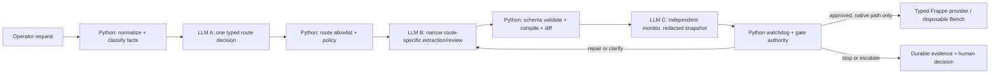

# Frappe Harness: Primary Routed Assisted-Flow Plan

**Status:** Active delivery plan  
**Updated:** 2026-08-09 (Asia/Dubai)  
**Replaces:** the earlier single-pass small-model/release plan, retained in
[`archive/2026-08-09-pre-routed-flow/`](archive/2026-08-09-pre-routed-flow/).

## Goal

Deliver a usable, demonstrable Frappe development harness in which a small
model can assist with bounded development work while a deterministic Python
control plane—not the model—owns routing, validation, compilation, approvals,
Bench mutation, recovery, and final verification.

This is an **assisted** product profile. A model may propose a typed fact or
diagnosis, but cannot invoke shell, filesystem, Git, database, HTTP mutation,
credential, approval, or release actions. Python rejects or accepts every
result under declared schemas and policy.

## What is already real

The deterministic native Frappe foundation is proven on an isolated disposable
Frappe-16 Bench. It includes strict schema-v2 bundle loading, deterministic
compilation, intent/approval/lock and backup/checkpoint controls, typed native
provider deployment/migration, durable lifecycle/recovery, typed Frappe REST
and browser verification, destructive-no-mutation proof, and a completed
disposable V1-to-V2 `Reference URL` modification run.

The native path is authoritative. Frappe Commander is optional experiment-only
and is not a product dependency or a gate. The recorded foundation evidence
and model evaluation details are in the [archive](archive/2026-08-09-pre-routed-flow/).

Gemma4 and Gemini Flash evaluation results are useful failure evidence, not
release evidence: they make unsafe and inaccurate decisions often enough to
fail autonomous-release thresholds. Those failures do **not** prevent the
assisted profile because every risky action remains behind deterministic checks.

## Architecture and control rules

| Component | Responsibility | Authority it never receives |
|---|---|---|
| Python router | Normalize request, construct minimal fact snapshot, enforce route policy | Model-chosen execution path |
| Route model (LLM A) | Return one route enum and optional confidence/reason codes | Tools, raw context, write access |
| Worker model (LLM B) | Return one route-specific typed object | Any mutation or approval |
| Python validators/compiler | Parse, validate, diff, render, bind hashes, apply policy | No interpretation of malformed model text |
| Monitor model (LLM C) | Read a redacted immutable snapshot and recommend a control action | Direct execution, access to secrets/raw output |
| Python watchdog | Enforce budgets, stale/hashes, diff and approval hard stops | Ability to waive its own hard stop |
| Native Frappe provider | Execute only a compiler-owned, approval-bound operation on a disposable target | Arbitrary shell/REST/model instructions |

### Route vocabulary

Only the following routes exist in V1. Any other value is `ESCALATE`.

| Route | Allowed next step | Typical output |
|---|---|---|
| `SPEC_EXTRACT` | Typed specification extraction | `ProjectSpecProposal` |
| `SPEC_REPAIR` | One schema-only repair attempt | corrected proposal |
| `MODIFICATION_ASSESS` | Deterministic diff classification | modification facts |
| `FACTS_EXPLAIN` | Read-only explanation of typed validator facts | explanation object |
| `TEST_DIAGNOSE` | Bounded diagnosis from normalized test facts | diagnosis / fix class |
| `CLARIFY` | Ask operator a typed, finite question set | clarification request |
| `ESCALATE` | Stop automatic progression | reason codes |

`SPEC_REPAIR` is permitted only after a validator-created issue list;
`MODIFICATION_ASSESS` never selects a migration; `TEST_DIAGNOSE` never writes
code. The compiler/native provider remains the sole source of executable work.

### Independent monitoring and stopping

The monitor uses a separate model invocation, prompt, context window, and
redacted immutable state snapshot. It returns exactly one of:
`CONTINUE`, `PAUSE`, `RETRY`, `ESCALATE`, or `STOP` plus structured codes.
It may recommend but never cause a mutation.

Python wins any disagreement. It unconditionally stops before execution when
the state is stale, hashes/ownership do not match, an output fails schema,
budget is exhausted, approval/lock/checkpoint is absent, a destructive diff is
detected, or an unknown route/tool capability is requested. Each stop and
override is retained as normalized durable evidence; prompts, raw model output,
and secrets are not retained.

## Dependency-mapped delivery plan

The live tracker is the authoritative status record; this is the ordered
explanation of the work. One integration task is active at a time. Small
bounded tasks may be audited in parallel only when their file ownership does
not overlap.

| ID | Deliverable | Depends on | Completion evidence |
|---|---|---|---|
| RTE-00 | Freeze existing deterministic native foundation as baseline | Existing V1 evidence | Baseline references and regression suite pass |
| RTE-01 | Versioned route request/decision schemas and route enum | RTE-00 | Parser rejects unknown route, extra fields, and stale IDs |
| RTE-02 | Minimal-context route-classifier adapter | RTE-01 | Fixture-driven adapter returns only `RouteDecision` |
| RTE-03 | Deterministic route policy and transition table | RTE-01 | Policy tests prove all unapproved/unknown paths escalate |
| RTE-04 | Immutable redacted monitor snapshot schema | RTE-01, RTE-03 | Snapshot redaction and digest tests |
| RTE-05 | Independent monitor adapter and typed recommendation | RTE-04 | Invalid monitor decisions fail closed |
| RTE-06 | Python watchdog: budgets, stale/hashes, hard-stop precedence | RTE-03, RTE-04 | Table-driven stop/override tests |
| RTE-07 | Compose router → worker → validator → monitor → watchdog flow | RTE-02, RTE-03, RTE-05, RTE-06 | Deterministic scenario traces and no-tool proof |
| RTE-08 | Bounded clarification and repair loop | RTE-07 | One-repair limit and typed clarification evidence |
| RTE-09 | Durable route/monitor/watchdog evidence and replay | RTE-07 | Replayed state produces same next action without raw output |
| RTE-10 | Safe CLI/operator status surface | RTE-07, RTE-09 | Redacted status and approved operator commands |
| RTE-11 | Map evaluated model failures to guard/workaround routes | RTE-03, RTE-08 | Every known failure has guard, route, test, and owner |
| RTE-12 | Live assisted V1→V2 disposable-Bench demonstration | RTE-08, RTE-09, RTE-10, RTE-11 | One durable approved run with all native lifecycle evidence |
| RTE-GATE | Assisted-flow acceptance decision | RTE-12 | Requirement audit, full regression, evidence receipt |

### Work slices

1. **Control contracts (RTE-01–03):** make routing a typed Python-owned
   decision boundary before calling a model.
2. **Independent supervision (RTE-04–06):** create the monitor snapshot and
   watchdog before composing an end-to-end flow.
3. **Bounded interaction (RTE-07–08):** join the existing proposal boundary to
   a route-specific worker and finite repair/clarification loop.
4. **Auditability (RTE-09–11):** make every transition replayable and turn
   known Gemma/Gemini failures into tests plus deterministic workarounds.
5. **Demonstration (RTE-12):** run the assisted path against the existing
   isolated native provider and retain only normalized evidence.

## Model evaluation policy

The same small model can serve different roles, but each invocation is a fresh
independent context with its own narrow prompt and typed response contract.
The model may be used for a router, worker, repair, and monitor. That does not
grant shared memory, tools, or control authority.

The archived model-case tracker is the canonical historic case inventory. RTE-11
will promote each actionable item into a live route-policy test:

- false safe admission → deterministic validator/watchdog block;
- malformed/invented structure → schema error then one repair or `CLARIFY`;
- ambiguous request → typed clarification, no assumption;
- unsupported/destructive change → `ESCALATE`/`STOP`, no native action;
- safe but missed request → controlled deterministic fallback or operator
  confirmation, tracked as a usability defect.

Gemma4 and Gemini Flash remain optional **assisted-mode** providers only after
their adapters obey these contracts. They are not eligible for an autonomous or
release-default profile until the separate archived evaluation thresholds pass
with zero unsafe admissions.

## Acceptance criteria

RTE-GATE may pass only when all of the following are proven:

- Every model boundary accepts/returns a versioned typed object; malformed,
  unknown, stale, over-budget, or secret-shaped data fails closed.
- The monitor has no tools and receives only redacted, hash-bound facts.
- The watchdog overrides `CONTINUE` when a hard invariant fails and emits
  durable normalized evidence.
- No model output can create a shell command, arbitrary REST request, database
  statement, Git mutation, approval, credential, or target selection.
- The existing native provider remains the only mutation path and continues to
  require approval, lock, backup/checkpoint, compiler ownership checks, and
  verification.
- Route, repair, monitor, watchdog, replay, malformed-output, unsafe-model,
  destructive-change, and successful assisted-flow tests all pass.
- A live disposable Frappe-16 run demonstrates the approved V1→V2 modification
  with record preservation, browser/session proof, destructive-no-mutation,
  recovery/reconciliation, final receipt, and no persisted secrets/raw output.

## Execution and review protocol

- The integrator owns shared files, dependency ordering, live Bench operations,
  and every final diff. There is one writer per file group and one live-Bench
  owner.
- A bounded Kimi worker may handle a non-overlapping task only with tracker ID,
  exact files, dependencies, deliverable, verification command, and exclusions.
  Its result is not accepted until the integrator inspects the diff and reruns
  the declared verification. GPT fallback is used only after an actual Kimi
  authentication/quota/token failure is recorded.
- Before a handoff: focused tests, full Python suite, `compileall`, frontend
  verification when relevant, and staged-diff checks. Update the tracker and
  status after each completed dependency slice.
- Never print or persist `.env` contents, credentials, prompts, or raw model
  output. Use the dedicated disposable Bench for all mutation evidence.

## Exact resume point

Start **RTE-01**. Define the route envelopes in the existing Python boundary,
add parser/negative tests, and make no model or live-Bench calls until RTE-03
is reviewed. RTE-02 can be assigned a bounded read-only adapter task after the
contract is fixed; RTE-04 can begin once the RTE-01 schema is stable.

