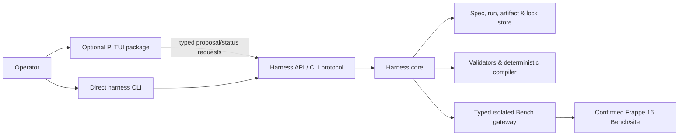

# ADR-001: Pi is an optional operator adapter, not the harness authority

**Status:** Accepted for V1 planning
**Date:** 2026-08-04

## Decision

Build the Frappe Small-Model Application Harness as a lightweight, direct core with a normal non-interactive CLI. The core is the sole authority for canonical specifications, validation, compiler output, approvals, locks, Bench execution, checkpoints, artifacts, recovery, and run receipts.

Use [Pi](https://github.com/earendil-works/pi) only as an optional, pinned package that provides an interactive interview and review TUI. Pi must remain removable: every V1 operator flow works through the direct CLI with Pi absent.

## Why

Pi is a practical TUI/client platform: extensions can register typed tools, commands, lifecycle handlers, custom rendering and TUI components; the SDK supports embedded sessions and explicit tool selection; and packages can distribute extensions, skills, prompt templates, and themes. [Extensions](https://pi.dev/docs/latest/extensions) · [SDK](https://pi.dev/docs/latest/sdk) · [TUI](https://pi.dev/docs/latest/tui) · [Packages](https://pi.dev/docs/latest/packages)

Pi cannot be the V1 trust boundary. Its documentation states that extensions and packages run with full system permissions, extensions can use Node built-ins, and skills may direct models to execute code. Pi project trust controls loading of local resources, not process confinement. Therefore, a Pi extension confirmation or tool interception hook is an operator convenience, not an independent enforcement mechanism. [Extensions](https://pi.dev/docs/latest/extensions) · [Skills](https://pi.dev/docs/latest/skills) · [Packages](https://pi.dev/docs/latest/packages)

## Target architecture

### Core

The core exposes a versioned JSON contract and owns all security-critical checks. Its normal CLI offers at least `init`, `inspect`, `draft`, `validate`, `plan`, `approve`, `apply`, `resume`, `status`, and `receipt`. A mutation can occur only after the core verifies the exact confirmed spec hash, approval authority, Bench/site/app binding, exclusive lease, ownership hashes, non-destructive diff, checkpoint, and backup.

The core must work headlessly for CI and recovery. It does not read Pi session files as its source of truth and does not provide Pi with Bench, database, or production credentials.

### Pi adapter

The optional `@<org>/frappe-harness-pi` package contains a project-local TypeScript extension and a curated `SKILL.md`. It provides commands such as `/harness`, `/spec`, `/validate`, `/plan`, `/status`, and `/approval`; a footer/progress widget; and a focused spec/diff review component.

The model-facing session exposes only typed proposal and read-only tools, for example:

- `get_supported_vocabulary`
- `submit_requirement_facts`
- `submit_clarifications`
- `propose_spec_patch`
- `get_validation_report`
- `request_human_approval`
- `harness_status`

It must not enable model-callable `bash`, `read`, `write`, `edit`, `pi.exec`, or any wrapper that accepts a path, command, query, or credential from the model. Pi sessions are supplemental and potentially sensitive; the core records only the linked Pi session identifier/hash when necessary.

## Operating rules

- Pin an exact Pi package/version or Git commit, commit its lockfile, and test an explicit compatibility range in CI.
- Treat extensions, skills, and packages as privileged supply-chain inputs; review and pin them before enabling project trust.
- Use explicit SDK tools (or no built-in tools) and a custom resource loader/isolated Pi agent directory for embedded operation. Do not rely on default discovery of local extensions, skills, prompts, or credentials.
- Pi UI confirmation never substitutes for core authorization; a headless core approval path is required.
- All extension lifecycle resources start after `session_start` and shut down idempotently at `session_shutdown`.
- Rebind the adapter on Pi new/resume/fork/session-replacement events. Widgets are display-only, width-aware, and never store authoritative state.
- Serialize all mutations in the core; never use extension/session memory as a lock.

## Adoption spike (before the Pi adapter is accepted)

1. Pin Pi and package a project-local extension plus a curated skill.
2. Start an interview session with no built-in filesystem or shell tools; expose only `harness_status` and one typed proposal tool.
3. Verify a malicious prompt cannot obtain filesystem, shell, Bench, database, or credential access.
4. Verify an attempted mutation is rejected unless the direct core has an exact approval and lease; replaying a stale request is rejected.
5. Show core run ID, scope, state, and artifact references in the Pi status UI.
6. Run the equivalent inspect/status flow through the direct headless CLI.
7. Test Pi session replacement and a package load against the pinned version.

## Consequences

This approach adds a small adapter package and integration tests, but keeps deterministic generation, migration safety, and recovery independent of a fast-moving agent/TUI host. The first implementation milestone remains the direct core and golden Task Tracker; Pi is introduced only after that core contract is testable.
