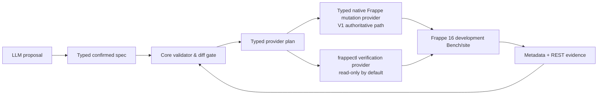

# ADR-002: Delegate Frappe metadata operations to native providers

**Status:** Accepted; native provider is the supported V1 path

## Decision

The harness will not ask a model to write DocType JSON or hand-build a live Frappe schema. It will retain a small typed canonical specification and compile it into a **typed provider plan**. The execution adapter then delegates live operations to Frappe-native tools:

- [frappectl](https://github.com/frappe/frappectl) is the preferred read/verification client. Its Frappe v16+ API support, DocType discovery, JSON output, read-only profiles, and credential handling make it suitable for inspected metadata and REST verification.
- [Frappe Commander](https://github.com/esafwan/frappe_commander) is an optional experimental development-site adapter. It is not a prerequisite for V1 and is never used for the authoritative golden role/REST path because its current release defaults new DocTypes to System Manager permissions.

The harness continues to own: supported vocabulary, structural validation, confirmed-spec hashing, diff classification, approval, run/lock state, target binding, command allowlisting, backup/checkpoint gates, verification comparisons, and receipts. Neither provider receives direct model-authored command text.

## Provider boundary

## Why

frappectl is a Frappe v16+ REST client with DocType discovery and a read-only profile mode that rejects unsafe HTTP methods locally; its mutation commands execute immediately, so the harness must still put it behind core approval and lock checks. [frappectl README](https://github.com/frappe/frappectl)

Commander exposes declarative Bench commands for creating DocTypes, fields, custom fields, and property changes, including required, unique, options, default, Link, Select, and positioning rules. It removes handwritten DocType JSON, but it is explicitly experimental and requires installing an additional app on the target site. [Commander README](https://github.com/esafwan/frappe_commander)

Commander does not replace the core compiler or the portable generated-app source boundary: it does not provide the full V1 role matrix, ownership/spec manifests, controller/test/frontend artifacts, hash-bound approvals, or migration recovery. The current V1 result therefore uses the typed native provider for authoritative mutation and verification; Commander remains a disposable, non-gating compatibility experiment.

## Rules

- `frappectl` read-only profiles are used for preflight, metadata discovery, REST verification, and post-migration comparison. Store no Frappe secret in the core run receipt or model context.
- The core may invoke writable `frappectl` only for explicitly allowed test data on a disposable development site, never as a model tool.
- Commander may run only on a confirmed Frappe 16 development site with its version pinned and installed as a declared dependency. No production-designated site is eligible, and Commander evidence never gates the native V1 release path.
- The Commander compatibility planner currently stores only structured `create_doctype` and `add_field` intents. It never accepts a free-form command, raw field mini-language, SQL, RPC path, or arbitrary JSON from a model. Permission rows, unapproved operation kinds, unsupported field types, and target versions other than Frappe 16 fail closed until a pinned, tested mapping is explicitly approved.
- Every mutation must have the core's exact approved spec hash, live metadata precondition, exclusive Bench/site/app lock, backup/source checkpoint, and command receipt.
- The existing artifact compiler plus typed native provider is the authoritative V1 source/metadata path. Commander remains a portable compatibility experiment and is not the source of truth for installed metadata.

## Spike acceptance

1. On a disposable Frappe 16 development Bench, pin and install Commander.
2. Translate the golden Task Tracker typed spec into a structured Commander plan; execute only after the normal core approval/lock gate.
3. Use read-only frappectl to fetch both DocTypes and compare fields, permissions, and Link targets with the confirmed spec.
4. Use frappectl REST operations to prove manager/user/no-role behavior.
5. Prove production, missing Commander, unsupported Frappe version, unapproved run, stale spec hash, and unexpected live metadata all fail closed.
6. Compare the Commander-created metadata to the preview artifacts and record every intentional difference in the Frappe 16 adapter.
