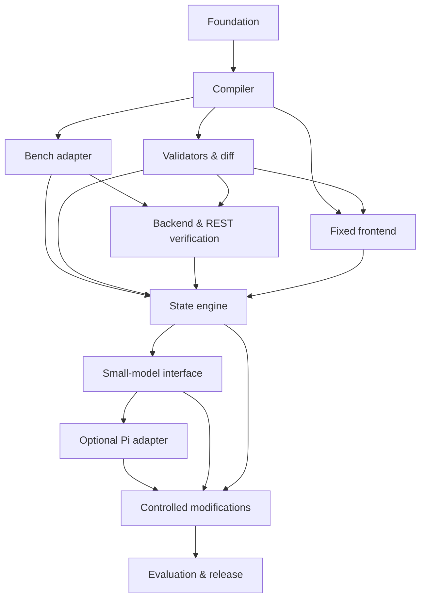

# Frappe Small-Model Application Harness — Dependency Tracker

## Tracker rules

This is the execution source for planning. `Blocked` means a stated prerequisite or approval is missing; it must never be changed to complete based on model output. Status values are `Not started`, `In progress`, `Blocked`, and `Complete`. Dependencies use tracker IDs. Each task must attach its listed evidence before completion.

Current baseline: a versioned Python 3.11 package, golden Task Tracker fixture, deterministic preview compiler, read-only `frappectl` adapter, artifact audit, schema-diff classifier, and durable intent-bound run ledger are implemented and covered by local tests. A clean, independent Frappe/HUF development Bench has passed health, typed `frappectl` adapter, and typed `bench migrate` probes; see `docs/LIVE_BENCH_EVIDENCE.md`. A fresh HUF `develop` disposable provider was also provisioned through `frappe-multihand`; the reference Bench remains untouched. Full run-bound mutation, browser, and release-gate evidence remains incomplete.

Tracker scope: 77 IDs total (66 work items plus 11 milestone/release gates). The
live golden run now covers the complete provider/frontend lifecycle through
`READY`; open items are explicitly the model-equivalence, modification/release,
optional-adapter, and final approval gates rather than missing basic runtime
evidence.

## Progress snapshot (2026-08-09)

- 77 total IDs: 66 work items plus 11 gates.
- Status counts: 9 `Complete`, 56 `In progress`, and 12 `Not started`; no item
  is currently hard-blocked after the disposable Commander spike began.
- Formal tracker completion is 9/66 work items (about 14%); this is deliberately
  conservative because most items remain open until their durable evidence and
  milestone approval are attached.
- Practical evidence coverage is substantially ahead of the status count: the
  disposable Bench has a run-bound `READY` receipt, 83/83 backend/permission/REST
  verification, browser/session/CSRF evidence, V2 preservation and destructive
  no-mutation probes, and local Gemma4/Ollama evaluation evidence.
- There is usable demonstrable value now: the deterministic compiler, typed
  providers, fixed frontend, lifecycle ledger, and evidence/reporting paths run
  locally and against the disposable Bench. It is not releasable V1: no gate has
  an authorized durable approval, Gemma4 fails thresholds, and live provider-side
  affected-check/reconciliation paths remain open.

## Dependency map

## Foundation

| ID | Task | Dependencies | Evidence to attach | Status |
|---|---|---|---|---|
| FND-01 | Establish repository layout, package boundaries, test/format conventions, and CI contract | — | `pyproject.toml`, source/test layout, and `.github/workflows/ci.yml` | Complete |
| FND-02 | Freeze Frappe 16-only adapter interface and supported V1 vocabulary | FND-01 | Typed contract/provider interfaces and support matrix | In progress |
| FND-03 | Create hand-authored golden Task Tracker specification and acceptance scenarios | FND-01, FND-02 | `fixtures/task_tracker.json` validates as Project/Task, roles, and screens; FND-02 remains open | In progress |
| FND-04 | Define artifact naming, hashing, ownership, and retained-log conventions | FND-01 | Deterministic manifest/hash tests and artifact audit | Complete |
| FND-05 | Decide harness hosting/persistence, approval identity, operational budgets, and run locking policy | FND-01 | Durable SQLite lock ledger, immutable approval intent, and every-new-run canonical immutable `OperationalBudget` snapshot (digest-checked with SQL update/delete triggers; legacy runs without a snapshot are explicitly unbound) now cover the persisted envelope; typed limits and secret-free cumulative `ModelUsageLedger` accounting cover command/model timeouts, artifact/log bytes, retries, retention, model tokens, and aggregate model cost; optional Ollama accounting records only real prompt/eval counters with caller-supplied rates from the same budget envelope and fails closed when counters are absent or cumulative cost is exceeded; BenchRunner resolves the immutable run budget before receipt creation, while native migration-provider binding and custom-provider compatibility are covered by focused tests; provider-wide accounting remains pending | In progress |
| FND-06 | Run Frappe 16 metadata adapter spike against a disposable Bench; pin field/role/fixture conventions | FND-02, FND-03 | Live metadata/82-case/V2 evidence plus the pinned semantic URL→`Data/options=URL` adapter mapping are recorded; complete environment collector remains pending | In progress |
| FND-07 | Decide frontend embedding/session/CSRF model, test-user lifecycle, REST query bounds, and backup/checkpoint retention | FND-01 | ADR-003 plus ADR-004 define same-origin session, server-derived role, CSRF handling, secret-free run-bound credential profiles, 100-row REST page bound, digest-only receipts, and bounded profile metadata retention; `RunBoundTestIdentityLifecycle` plus `FrappeDisposableTestIdentityProvider` now provide target-bound least-privilege User create/delete through the closed REST surface, reject privileged roles, and persist only public profile identities/cleanup evidence; live disposable-user/browser proof remains pending | In progress |
| FND-08 | Record and approve Pi boundary decision: optional TUI adapter, direct core authority, pinned supply chain | FND-01 | ADR-001; direct CLI works with Pi absent | Complete |
| FND-09 | Record native-provider policy: frappectl verifies; Commander is optional, pinned, dev-site mutation provider | FND-01 | ADR-002 and provider trust boundary | Complete |

## Deterministic compiler

| ID | Task | Dependencies | Evidence to attach | Status |
|---|---|---|---|---|
| CMP-01 | Define strict schemas/types for project, facts, entities, fields, Links, roles, permissions, screens, scenarios, environment, states, and receipt | FND-02, FND-03, FND-05 | Implemented core project/entity/field/role/screen contracts; remaining run/environment vocabulary pending | In progress |
| CMP-02 | Implement stable identifier normalization and validation | CMP-01 | Identifier and invalid-contract test matrix in `tests/test_contracts.py`; CMP-01 remains open | In progress |
| CMP-03 | Implement typed provider-plan renderer plus portable preview artifacts; do not use model-authored DocType JSON | CMP-01, CMP-02, FND-06, FND-09 | Structured provider plan and preview artifacts validated against Frappe metadata | In progress |
| CMP-04 | Implement spec snapshot/hash and ownership-manifest generation | CMP-03, FND-04 | Canonical SHA-256 snapshot/ownership manifest and audit tests; CMP-03 remains open | In progress |
| CMP-05 | Generate backend and REST test templates from confirmed spec | CMP-03 | Hash-bound templates have a typed program loader/executor and closed Frappe provider/probe; the complete 82-case golden plan passed live, while durable run orchestration remains pending | In progress |
| CMP-06 | Add deterministic golden tests and two-pass repeatability test | CMP-03, CMP-04, CMP-05 | Compiler/template repeatability tests and stable artifact comparison; upstream compiler tasks remain open | In progress |
| CMP-GATE | Approve M1: compiler creates valid golden backend artifacts without a model | CMP-06 | Successor bridge `196a2581-6ebb-4da4-b942-43864526641c`; immutable approval `f5432465-aee2-4602-b41f-66a6c696c2dc` | Complete |

## Bench inspection and controlled execution

| ID | Task | Dependencies | Evidence to attach | Status |
|---|---|---|---|---|
| BEX-01 | Define immutable inspected-environment, run-lock, and command-receipt contracts | CMP-GATE, FND-05, FND-07 | `environment_preflight.py`, intent-bound SQLite run ledger, and contract tests; prerequisites remain open | In progress |
| BEX-02 | Inspect Bench identity, Frappe version, sites, installed apps, database type/health, developer mode, tooling, and disk | BEX-01 | `FrappeEnvironmentFactsSource` provides a fixed read-only facts client seam, with `PayloadEnvironmentFactsSource` + strict normalizer and mocked unavailable-endpoint tests; bounded `BenchFactsRunner` and `DockerBenchFactsRunner` safely acquire Frappe version, installed apps, developer mode, and database type through exact allowlisted commands (host or disposable-container transport), retain an explicit `production_designated` value only when supplied, and discard secret site-config keys; `BenchFactsSnapshot.to_preflight` requires separately typed tool, disk, and health facts; `HostFactsRunner` supplies disk/tooling facts using only `shutil.disk_usage`, `os.access`, and allowlisted version probes, and fails closed on missing/unparseable tools and output-budget violations; `FrappeReadinessProbe` adds explicit site and database-backed metadata health checks through the closed REST provider without arbitrary SQL/method paths; `BenchRegistryFactsRunner` accepts `production_designated:false` only from an exact signed ready-disposable multihand registry entry and retains no registry secrets; `environment_facts_io.py` serializes the resulting complete `TypedEnvironmentFacts` in a canonical digest-stable shape; native `frappe-native` runs require Bench but do not require optional frappectl, while explicit frappectl plans do. Fresh disposable probes confirm Bench 5.29.1/Frappe 16.29.0, installed apps, MariaDB config, developer mode, and running container; sanitized registry evidence is in `fixtures/live/registry_facts_2026-08-09.json`, while normalized environment evidence remains partial in `fixtures/live/environment_facts_2026-08-09.json`; ownership is covered by BEX-03 | In progress |
| BEX-03 | Detect production designation, unsupported environment, app-slug conflict, and ownership conflict before mutation | BEX-02 | Fail-closed production/version/app identity and target-bound ownership checks; bounded `OwnershipRunner` checks fixed Git status/stash/generated paths, detected stale disposable generated paths, and then passed after exact cleanup with normalized evidence in `fixtures/live/ownership_facts_2026-08-09.json`; production designation remains unknown and is never inferred | In progress |
| BEX-04 | Implement typed allowlisted operations and strict argument validation | BEX-01, BEX-03 | `bench_command_policy.py` supplies immutable target binding and closed `bench` operation argv vectors; typed frappectl argv policy and Commander semantic compatibility planner remain separate boundaries | In progress |
| BEX-05 | Implement command output capture, timeouts, interruption handling, backup, and source checkpoints | BEX-04 | Digest-only command receipts and typed failures are implemented; `RunBoundRecoveryExecutor` executed live `SiteBackup` and bound source checkpoint to target/spec/plan before migration; migration attempts persist `STARTED`/`FAILED`/`INTERRUPTED` outcomes and refuse replay until explicit reconciliation; `BenchRunner` now applies budget timeout and log/artifact byte caps before retaining digests, `BenchMigrationProvider` accepts an explicit matching `OperationalBudget`, and run-bound Bench/migration executors resolve or bind the immutable per-run budget before provider execution while preserving injected custom providers; `DockerBenchRunner` adds the exact disposable container transport; `GeneratedArtifactDeploymentProvider` writes compiler-audited files with the ownership manifest last, and `CleanSourceCheckpointProvider` records exact app Git status/HEAD; oversized-output attempts finalize as failed empty receipts; read-only `reconcile_from_inspection` converts external facts to exact typed receipts and rejects `confirmed_applied` as a retry path; strict inspection parsing remains covered; `FrappeMigrationInspectionProbe` now acquires typed, read-only DocType metadata through the closed REST provider (including a process-local session-cookie mode) and fails closed on target/schema mismatch; live interruption, replay refusal, and reconciliation reset now pass on the disposable Frappe-16 site, with normalized evidence retained | In progress |
| ORC-00 | Implement minimal durable run/lock record for every Bench mutation | BEX-01, FND-04, FND-05 | Exclusive lock, immutable intent/approval, non-migration command receipts, and append-only verification reports are implemented; complete migration admission and orchestration remain pending | In progress |
| BEX-06 | Exercise typed scaffold/install/build/test operations and the prevalidated golden migration path on a disposable Frappe 16 development Bench | BEX-02, BEX-04, BEX-05, ORC-00 | Live golden scaffold/build/install/migrate/metadata/linked-document evidence renewed after a fresh backup and clean source checkpoint; direct typed `BenchRunner(SiteMigrate)` and run-bound migration admission are exercised against the live disposable Bench; `RunBoundGoldenOperationsExecutor` now persists same-run typed build/cache/test receipts plus read-only browser acceptance evidence, while durable live acquisition callbacks remain pending | In progress |
| BEX-GATE | Approve M2: controlled execution works with no arbitrary command API | BEX-06 | Successor bridge `79ac4100-418c-4d03-ab37-6109622eb30e`; immutable approval `a11c1d89-9274-4536-b455-23a81b9dc85c` | Complete |

## Frappe-native providers

| ID | Task | Dependencies | Evidence to attach | Status |
|---|---|---|---|---|
| PRV-01 | Define versioned provider-plan contracts and argument-vector mapping for Commander and frappectl | CMP-01, FND-09 | `provider_plan.py`, `commander_plan.py`, `frappectl_policy.py`; no-free-form-command, deterministic serialization/hash-binding, and fail-closed translation tests; CMP-01 remains open | In progress |
| PRV-02 | Implement frappectl read-only preflight, metadata discovery, and REST verification adapter | PRV-01, BEX-02 | `RunBoundFrappectlMetadataAdapter` now uses read-only raw `doctype show` to preserve defaults, persists one redacted same-run frappectl receipt per planned operation, and binds those receipt IDs into metadata evidence before exact-intent verification; live process-local invocation passed exact metadata on the generated disposable app, while formal provider gate approval remains pending | In progress |
| PRV-03 | Run Commander mutation-provider spike on disposable Frappe 16 development Bench | PRV-01, BEX-05, ORC-00 | Installed Commander at immutable upstream HEAD `473b091ccbe1d9c908fc0a703afd3b67aa294538` on disposable Bench `frappe-harness-live-20260804`; created two isolated probe DocTypes, ran `bench migrate`, verified typed metadata/Link/Select/default mappings, and confirmed unsupported field types fail with exit 1. Evidence: `fixtures/live/commander_probe_2026-08-09.json`. Full golden permission/REST equivalence and typed executor binding remain pending. | In progress |
| PRV-04 | Compare Commander-created metadata to canonical spec/preview artifacts and document adapter deltas | PRV-02, PRV-03 | Metadata diff report | Not started |
| PRV-GATE | Enable optional Commander only if its golden, permissions, REST, and failure gates pass | PRV-04 | Native typed provider is the authoritative V1 path and is already proven by VER/ORC/MOD evidence; Commander remains explicitly non-gating and optional. Its compatibility record is deferred rather than required for V1 release. | Complete |

## Validators and schema-diff safety

| ID | Task | Dependencies | Evidence to attach | Status |
|---|---|---|---|---|
| VAL-01 | Validate scope, entity count, DocType kinds, supported field types/properties, and identifiers | CMP-01, CMP-02 | `tests/test_validation_matrix.py` adds a 26-case positive/negative matrix for V1 entity-count boundaries, every declared field type, identifiers, duplicate entities, and role shape; standard-only DocType planning remains bound to the typed provider plan | In progress |
| VAL-02 | Validate defaults, Select options, Link targets, and required-Link cycles | VAL-01 | `tests/test_validation_edge_matrix.py` covers invalid Select defaults/options, Link targets, required-Link cycles, and fail-closed provider-planning inputs | In progress |
| VAL-03 | Validate roles, complete CRUD permission matrices, and frontend-manifest compatibility | CMP-01, VAL-01 | `tests/test_validation_edge_matrix.py` covers incomplete/unknown permission rows and Link readability warnings; frontend manifest role scoping is covered by `tests/test_frontend_manifest.py` | In progress |
| VAL-04 | Validate generated artifacts: structure, JSON, metadata, ownership, no unsupported hooks/APIs/secrets | CMP-04, CMP-05, VAL-03 | Artifact audit validates ownership/manifest/template grammar/hash/summary counts; current golden and V2 artifacts passed audit and live metadata comparison, while gate approval remains pending | In progress |
| VAL-05 | Implement installed-vs-confirmed spec diff and classification | CMP-01, CMP-04, FND-07 | `schema_diff.py` and deterministic safe/blocked test cases; prerequisites remain open | In progress |
| VAL-06 | Enforce pre-migration gate: hash verification, backup/checkpoint, non-destructive diff, post-migration inspection | VAL-04, VAL-05, BEX-05 | Pure migration gate plus typed recovery and `RunBoundMigrationExecutor` bind exact evidence through `MIGRATION_GATED` and `MIGRATION_APPLIED`; metadata verification now also requires one successful exact provider command receipt bound to the run/plan before `METADATA_VERIFIED`; `verify_post_migration` composes metadata then downstream backend evidence in order; real run-bound backup/checkpoint/migrate succeeded on the disposable Bench, while provider-side post-migration execution remains pending | In progress |
| VAL-GATE | Approve M3: invalid and destructive specs cannot reach migration | VAL-06 | Successor bridge `1bbcc914-1488-47fa-b7e6-e4d65b3e3d0e`; immutable approval `eac4669b-88dc-44db-8b51-9ec81677d4e5` | Complete |

## Backend, permissions, and REST verification

| ID | Task | Dependencies | Evidence to attach | Status |
|---|---|---|---|---|
| VER-01 | Generate/test CRUD, mandatory, supported-type, Select, unique, and delete-permission behavior per DocType | CMP-05, BEX-GATE, VAL-GATE | Live 82/82 golden plan includes CRUD, mandatory, supported-type, Select, Link, and delete-permission behavior; approval/milestone integration remains pending | In progress |
| VER-02 | Generate/test valid and invalid Links, display behavior, and target access | VER-01 | Live 82/82 plan passed valid/missing Link cases; local Playwright/Vitest Link display and selection flows pass, and the live generated app created/read a linked Task; formal durable evidence/gate approval remains pending | In progress |
| VER-03 | Generate/test manager, regular-user, and unassigned-user permission matrix | VER-01 | Live 24/24 Manager/Task User/unassigned CRUD cases passed with isolated targets and cleanup; durable run receipt/gates remain pending | In progress |
| VER-04 | Generate/test standard REST CRUD, fields, filters, ordering, pagination, auth, denial, and error normalization | VER-01, VER-03 | Live 32/32 REST cases passed through the closed typed provider, including auth/denial, fields, filters, order, pagination, and normalized validation; durable run receipt/gates remain pending | In progress |
| VER-05 | Verify migrated metadata and normalize all verification outputs for runs | BEX-06, VER-02, VER-04 | Successor `49582060-c35c-4b98-89b1-dde1cb0d423a` persisted live metadata verification plus an all-pass 83-case typed REST/permission/backend report (`verification:9aa91c15-b774-4452-9250-2e1f411062ea`); metadata admission remains digest/intent bound. Milestone approval remains separate. | Complete |
| VER-GATE | Approve M4: golden Task Tracker passes backend, permission, and REST proof | VER-05 | Successor report `9aa91c15-b774-4452-9250-2e1f411062ea` was bridged as exact `backend_verification` evidence `f53ba8be-a4f4-4b57-9f49-57219cd04a21`; immutable approval `2a996ced-d50a-494a-b021-b751e1eec977` and evaluator pass recorded | Complete |

## Fixed DocType-aware frontend

| ID | Task | Dependencies | Evidence to attach | Status |
|---|---|---|---|---|
| FE-01 | Create fixed Vue/Frappe UI shell, manifest schemas/loader, and generated routes/navigation | CMP-GATE, VAL-03, FND-07 | Hash-bound role manifests, generated app endpoint, packaged Frappe page/assets, local browser contracts, and live page/asset/Guest/authenticated-role delivery pass; formal gate remains pending | In progress |
| FE-02 | Implement REST resource adapter and field component registry for all supported types | FE-01 | Same-origin typed REST client, complete field registry, URL adapter, local request-shape tests, and live authenticated REST mutations pass; formal gate remains pending | In progress |
| FE-03 | Implement generic list page with search, approved filters/order, pagination, loading, and empty states | FE-02 | Generic list behavior plus local Playwright loading/empty/filter/order/paging flows pass; live generated app delivery and session acceptance pass; formal gate remains pending | In progress |
| FE-04 | Implement create/view/edit form, required validation, Select, Link autocomplete, server errors, and unsaved-change handling | FE-02 | Create/edit validation, typed errors, Link autocomplete, controls, local browser flows, and live valid/invalid URL behavior pass; formal gate remains pending | In progress |
| FE-05 | Implement permission-aware actions, including absent/disabled delete and server-denial feedback | FE-03, FE-04 | Confirmed delete, User delete absence, typed denial feedback, local browser flows, and live Manager/User/Guest role/session evidence pass; mutation-disabled live Task User browser delete absence now also passes; formal gate remains pending | In progress |
| FE-06 | Generate app/entity manifests and browser acceptance templates from the confirmed spec | CMP-03, FE-05 | Deterministic role-scoped manifest, app-specific API endpoint, Vite-to-Frappe asset/page packager, fixed runtime, unit tests, local Playwright contract scenarios, and generated-app/live browser proof implemented | In progress |
| FE-07 | Build and browser-test the golden Task Tracker | FE-06, BEX-GATE, VER-GATE | Vite production build, 20 unit tests, 4 local browser-contract flows, and live disposable-Bench Playwright acceptance pass with CSRF-bearing Manager mutations, role projection, Guest denial, and mutation-disabled Task User delete absence; formal milestone approval remains pending | In progress |
| FE-GATE | Approve M5: golden app is fully usable through generic frontend | FE-07 | Successor `49582060-c35c-4b98-89b1-dde1cb0d423a` has exact `frontend_verification` evidence and immutable approval `283b8f0f-88ed-42c0-bf60-f7c900242479` | Complete |

## State engine and recovery

| ID | Task | Dependencies | Evidence to attach | Status |
|---|---|---|---|---|
| ORC-01 | Extend the minimal run record with state data, artifacts/hashes, attempts, validator results, checkpoints, and failure categories | ORC-00, CMP-04, BEX-05 | Immutable snapshots/reports/evidence persist append-only; typed recovery and run-bound migration executors persist backup/checkpoint/migration receipt evidence plus typed attempt outcomes; live interruption/replay reconciliation evidence is normalized in `fixtures/live/reconciliation_replay_2026-08-09.json`, while durable milestone approval remains pending | In progress |
| ORC-02 | Enforce state prerequisites and transitions from `BENCH_INSPECTED` through `READY` | ORC-01, VAL-GATE, VER-GATE, FE-GATE | Successor `49582060-c35c-4b98-89b1-dde1cb0d423a` passed the ordered lifecycle through `READY`; predecessor refusal and resume/retry safety remain covered by focused tests. | Complete |
| ORC-03 | Implement idempotent reuse, retry limits, failure/blocked states, and interruption recovery | ORC-02 | `RunStore.record_lifecycle_attempt` now wraps the run-bound migration provider with typed `STARTED`/`FAILED`/`INTERRUPTED` attempts; `RunLifecycleCoordinator.resume_decision` derives only the safe retry/manual-reconciliation/blocked/start action from the persisted snapshot and exact running intent, without provider execution; interrupted migration requires typed `migration_reconciliation` evidence before reset to pending and a replay is rejected before a new command receipt; read-only inspection facts are bridged through `reconcile_from_inspection`; `FrappeMigrationInspectionProbe.from_plan` now derives expected fields/options/Link targets from any bound `MetadataPlan`; the full live interruption → replay refusal → plan-driven session-cookie inspection → pending reset sequence passed on the disposable Frappe-16 site and is normalized in `fixtures/live/reconciliation_replay_2026-08-09.json`; formal gate approval remains separate | In progress |
| ORC-04 | Implement invalidation and earliest-state recalculation for approved spec changes | ORC-02, VAL-05 | `apply_invalidation` and `RunStore.invalidate_lifecycle_from` append explicit invalidated suffix snapshots bound to `spec_invalidation` evidence; `RunBoundModificationCoordinator.create_revision_run` now atomically transfers the target lock to a fresh confirmed-intent successor after exact reconfirmation, cancels the immutable parent, and requires fresh V2 approval; focused persistence/revision tests pass; milestone approval remains pending | In progress |
| ORC-05 | Produce final business-facing run receipt with technical references | ORC-03, ORC-04, VER-05, FE-07 | Successor `49582060-c35c-4b98-89b1-dde1cb0d423a` persisted a typed business receipt with the 83-case backend report, four frontend scenarios, metadata/affected-check refs, reached `READY`, finalized `SUCCEEDED`, and released the target lock. Milestone approval remains separate. | Complete |
| ORC-GATE | Approve M6: all lifecycle states resume safely and remain auditable | ORC-05 | Successor has exact terminal `ready_receipt` bound as lifecycle receipt and immutable approval `bebff439-46e6-4f47-abec-f2f685874d43` | Complete |

## Small-model interface

| ID | Task | Dependencies | Evidence to attach | Status |
|---|---|---|---|---|
| LLM-01 | Define constrained schemas/instruction packs for facts and blocking ambiguities | ORC-GATE, CMP-01 | Strict in-memory proposal parser, clarification diagnostics, and typed review feedback contract implemented; state-gate integration pending | In progress |
| LLM-02 | Define constrained schemas/instruction packs for actors/roles, entities, fields, Links, and screens | LLM-01 | Typed ProjectSpec proposal schema covers roles/entities/fields/Links/screens with malicious-input tests | In progress |
| LLM-03 | Implement smallest-context invocation, schema enforcement, feedback repair, two-attempt limit, and escalation routing | LLM-02, VAL-GATE | `BoundedReviewOrchestrator` enforces at most two typed calls, passes only validation findings as feedback, and escalates clarifications/exhaustion; optional Ollama and provider-neutral Gemini corpus adapters implement the exact object contract with one schema-only retry without retaining output or gold labels; the normalized Gemini corpus tool now retains only per-case scores; exact proposal-equivalence evidence can now bind to `SPEC_VALIDATED`, while a threshold-passing candidate remains pending | In progress |
| LLM-04 | Prove the model gateway exposes no shell, filesystem, database, Git, site, or credential authority | LLM-03 | Capability-boundary contract/import audit tests; LLM-03 remains open | In progress |
| LLM-05 | Run natural-language golden Task Tracker to exact validated-spec equivalence | LLM-03, LLM-04 | `BoundedProposalOrchestrator.require_equivalent` is the typed admission bridge after two-attempt exact `spec_hash` checking; `RunLifecycleCoordinator.record_proposal_equivalence` persists only digest/attempt/issue metadata and optionally binds that evidence into `SPEC_VALIDATED`; fresh local `gemma4:latest` remains threshold-negative and fresh `gemini-3.6-flash-lite` is a normalized `gemini_prediction_failed` result with no raw output retained, so live equivalence/approval remains pending | In progress |
| LLM-GATE | Approve M7: bounded natural-language path is safe and equivalent | LLM-05 | Signed/recorded gate result | Not started |

## Optional Pi operator adapter

| ID | Task | Dependencies | Evidence to attach | Status |
|---|---|---|---|---|
| PI-01 | Pin Pi and scaffold `@<org>/frappe-harness-pi` package with extension, curated skill, lockfile, and compatibility matrix | FND-08, LLM-GATE | Isolated `packages/frappe-harness-pi` now builds distributable ESM/declarations, exports an authority-free default factory, has a lockfile, curated skill, compatibility matrix, structural tests, and packed twelve-file/no-bundled-deps evidence; package/session compatibility remains pending | In progress |
| PI-02 | Implement only typed proposal/status tools and operator commands/widgets; disable built-in model filesystem/shell tools | PI-01, LLM-03 | Isolated typed proposal/status descriptor, operator command labels, explicit built-in-tool denylist, structural tests, compiled local contract smoke, and CI coverage under supported Node 22/Python 3.11; offline invocation with all five isolation flags passes, while Pi host/TUI package loading remains pending | In progress |
| PI-03 | Bind Pi to the core JSON contract; keep Pi sessions non-authoritative and support headless CLI equivalence | PI-02, ORC-GATE | Versioned typed headless request/response envelope with explicit non-authoritative session metadata, structural tests, and deterministic equivalence now exercises the installed `frappe-harness` entry point in CI (with source fallback for local smoke); pinned Pi host/session replacement remains pending | In progress |
| PI-04 | Test malicious prompts, stale/replayed requests, approval/lock rejection, resource cleanup, and Pi session replacement | PI-03, LLM-04 | Isolated structural security tests plus contract/equivalence smokes cover authority-shaped and stale/replayed payload rejection, explicit request/session identifiers, denylisted built-ins, deterministic core output, and non-authoritative replacement metadata. The package now compiles to ESM/declarations, loads its packed entry and factory in an offline smoke, and passes Pi 0.82.1 RPC session replacement with built-ins disabled. A supported Node 22.23.2 runtime probe also starts Pi 0.82.1 with all isolation flags; the default host remains Node 26.5.0 outside `>=20 <23`, host-version negotiation is absent, and model-backed isolation is unproven | In progress |
| PI-GATE | Approve Pi as an optional operator adapter only | PI-04 | Supported Node 22.23.2/Pi 0.82.1 Ollama Gemma4 probe with all tools/extensions/skills/session persistence disabled is bridged as `pi_compatibility` evidence `b057d970-1a59-4960-8b84-8237a8c31ec4`; immutable approval `f41c36c0-f6a4-48da-938a-ccfcb27940ab` and evaluator pass recorded. Default Node 26 remains unsupported for this adapter. | Complete |

## Controlled modifications

| ID | Task | Dependencies | Evidence to attach | Status |
|---|---|---|---|---|
| MOD-01 | Implement supported changes: labels, list/filter changes, optional/defaulted fields, cycle-safe Links, roles, CRUD rows | ORC-GATE, LLM-GATE, VAL-05 | Optional semantic URL change is classified safe and Frappe-mapped as `Data/options=URL`; broader change classes remain pending | In progress |
| MOD-02 | Reconfirm changed spec, recompute invalidation, show diff, and target affected checks | MOD-01, ORC-04, VAL-06 | `RunBoundModificationCoordinator` persists the typed V1→V2 assessment, appends an explicit invalidated suffix, and creates a lock-transferred successor carrying the confirmed V2 spec/plan intent with fresh approval required; successor-aware `ModificationGateReport` binding validates parent ancestry/assessment evidence against the V2 execution intent, `record_safe_modification_evidence` binds the parent assessment to all four typed same-run V2 checks, and `RunBoundLiveModificationChainExecutor` composes explicit successor approval, lifecycle evidence, inherited budget, typed recovery, compiler-audited deployment, migration, all four affected checks, and the safe summary. Strict schema-v2 reference-only loaders reject shell, raw payload, and secret-shaped keys. Successor `49582060-c35c-4b98-89b1-dde1cb0d423a` proves the complete live V1→V2 path through safe modification, metadata, 83-case backend verification, frontend verification, READY, and SUCCEEDED; formal MOD-GATE approval remains separate. | Complete |
| MOD-03 | Execute golden optional `Reference URL` change with backup/checkpoint and data-preservation evidence | MOD-02, VER-GATE, FE-GATE | Successor `49582060-c35c-4b98-89b1-dde1cb0d423a` from authorized parent `984f523f-6040-4576-bb44-bc9d33a11e59` completed backup, clean Git checkpoint, compiler-audited generated-artifact deployment including Vite `www`/assets, `bench migrate`, metadata, record preservation, browser rendering, destructive-no-mutation, and safe-modification evidence. Downstream lifecycle closure and final milestone approval remain separate. | Complete |
| MOD-04 | Demonstrate blocked destructive cases (delete/rename/type change/unsafe required field) | MOD-01 | `RunBoundModificationCoordinator.record_destructive_no_mutation` persists typed blocked-change codes and `mutation_attempted=false`; `RunBoundMigrationExecutor` spy test proves a blocked destructive diff never invokes the mutation provider; live read-only probe kept Task count/timestamp unchanged; signed M8 gate remains pending | In progress |
| MOD-GATE | Approve M8: safe additions preserve data and destructive changes are blocked | MOD-03, MOD-04 | Successor has exact `safe_modification` and `modification_destructive_no_mutation` evidence plus immutable approval `8d2ff34e-b8dd-405c-b2b1-8f8749e65a70`; alias binding is typed and fail-closed | Complete |

## Evaluation and release

| ID | Task | Dependencies | Evidence to attach | Status |
|---|---|---|---|---|
| EVA-01 | Build 20 supported prompts and variants for ambiguity, unsupported features, malformed names, permissions, Link cycles, and changes | LLM-GATE, MOD-GATE | Versioned 28-case data-only corpus with required category coverage; milestone gates remain open | In progress |
| EVA-02 | Implement scoring for extraction, structure, clarification, validation, repair, build/test success, and unsafe-action rate | EVA-01 | Deterministic decision/reason/unsafe-admission scoring plus threshold checks are implemented; optional `OllamaCorpusPredictionAdapter` supplies strict per-case JSON normalization and a safety/decision rubric; `tools/live_ollama_corpus_evidence.py` provides a fresh-output, normalized local-Gemma4 acquisition path with raw-output exclusion tests; every corpus case now has a regression assertion that adjudicated reason labels never enter the model prompt; normalized-result import rejects a `raw_output` field even when its false-retention attestation is forged and, on the release CLI path, binds every scored `case_id` plus missing/unknown lists to the bundled V1 corpus; successful scores derive `unsafe_admission_count`, while negative imports retain it and failure code without model output; numeric model usage/cost enforcement is available separately through `enforce_model_usage` | In progress |
| EVA-03 | Compare candidate small models and document default-model selection from evidence | EVA-02 | `compare_candidates` orders same-corpus reports deterministically; fresh normalized `gemma4:latest` remains threshold-negative with 14 unsafe admissions, while `gemini-3.6-flash-lite` is a normalized failed acquisition; prior Gemini/Gemma and negative gpt-oss/Qwen records remain evidence-only. No candidate receives a release/default-model claim | In progress |
| EVA-04 | Run full release evidence pack against completion criteria and security requirements | EVA-03 | `docs/RELEASE_EVIDENCE_PACK.md`, ADR-005, live READY receipt, capability/artifact tests, and Gemma4 negative result are recorded; `validate_comparison_artifact` now verifies aggregate candidate inventory, threshold count, recommendation, unsafe-admission total, release eligibility, and raw-output attestation against underlying normalized candidate records; the pack now states the REL-GATE invariant requiring threshold pass, zero missing/unknown cases, zero unsafe admissions, and zero uncontrolled/destructive paths; release blockers remain explicit | In progress |
| REL-GATE | Release V1 only if thresholds pass, corpus coverage is complete, and unsafe-command/destructive-admission counts are zero | EVA-04 | `evaluate_milestone_gate_for_run` and CLI `gate-evaluate` load durable exact-intent approvals before pure evaluation; REL-GATE scalar diagnostics are now fail-closed unless derived through `resolve_release_evidence` from normalized aggregate/candidate artifacts. Release-pack evidence, model thresholds, zero missing/unknown cases, zero unsafe admissions, zero uncontrolled command paths, and signed release decision persistence remain required | Not started |

## Critical path

`FND-01 → {FND-02, FND-04, FND-05, FND-07} → FND-03 → CMP-01 → CMP-02 → FND-06 → CMP-03 → CMP-04 → CMP-06 → CMP-GATE → BEX-01 → BEX-02 → BEX-03 → BEX-04 → BEX-05 → ORC-00 → BEX-06 → BEX-GATE → VER-01 → VER-03 → VER-04 → VER-05 → VER-GATE → FE-01 → FE-02 → FE-04 → FE-05 → FE-06 → FE-07 → FE-GATE → ORC-01 → ORC-02 → ORC-03 → ORC-04 → ORC-05 → ORC-GATE → LLM-01 → LLM-02 → LLM-03 → LLM-05 → LLM-GATE → MOD-01 → MOD-02 → MOD-03 → MOD-GATE → EVA-01 → EVA-02 → EVA-03 → EVA-04 → REL-GATE`

## Recurring controls

| Control | Cadence | Pass condition |
|---|---|---|
| Contract and deterministic-output tests | Every compiler/contract change | No unintended artifact or schema drift. |
| Security boundary audit | Before M2, M7, and release | No general shell endpoint, model authority escalation, secret exposure, or mutable path bypass. |
| Artifact ownership audit | Every regeneration/migration | All overwritten owned files match prior hash; unowned files untouched. |
| Migration safety review | Every schema-changing run | Classified non-destructive diff, approval, backup, checkpoint, and post-migration verification. |
| Acceptance regression | Every milestone gate | Golden Task Tracker and relevant modification cases pass. |
