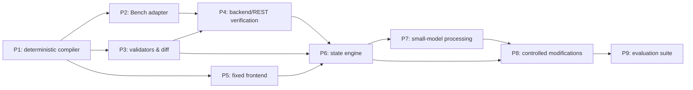

# Frappe Small-Model Application Harness — V1 Delivery Plan

## Purpose and scope

This plan turns the V1 product specification into a dependency-first delivery sequence. V1 is a constrained compiler and workflow engine for Frappe 16—not an autonomous coding agent. It accepts a confirmed typed application specification and produces one to five standard DocTypes, explicit roles and permissions, a reusable DocType-aware frontend, standard REST CRUD access, and a resumable audited run.

The implementation baseline is the **golden Task Tracker**: Project and Task DocTypes; Task User and Task Manager roles; standard Desk and REST behavior; and a generic custom frontend. It is the first end-to-end proof for every phase.

Out of scope: Bench provisioning, production deployment, custom controllers or APIs, workflows, child tables, external integrations, guest writes, destructive schema changes, and arbitrary model-authored code or commands.

## Delivery principles

- The canonical, confirmed project specification is the only compiler input; conversation text is never a generation source.
- Model output is typed proposal data only. Validators, the compiler, and the state engine decide completion.
- All Frappe 16 file rendering flows through a version adapter.
- Bench execution is typed and allowlisted; no API accepts arbitrary shell text or model-selected paths.
- Every migration has an approved non-destructive diff, artifact-hash check, site backup, and source checkpoint.
- The compiler owns only files declared in its ownership manifest. A modified owned file blocks regeneration.
- A phase may not advance until its exit gate and listed tracker dependencies pass.

## Architecture and delivery order

## Operator interface decision

The direct lightweight harness core and its non-interactive CLI are the V1 authority. [ADR-001](ADR-001-PI_OPERATOR_ADAPTER.md) records the decision to add [Pi](https://github.com/earendil-works/pi) only as an optional, pinned operator TUI package after the core contract is available. Pi may collect typed requirements, display validation/diff/status information, and request human approval; it may not own execution state or expose model shell, filesystem, database, or credential access.

## Frappe-native provider decision

[ADR-002](ADR-002-FRAPPE_NATIVE_PROVIDERS.md) replaces live handwritten DocType JSON with a typed provider plan. `frappectl` is the default read/verification provider; Frappe Commander is an optional, pinned development-site mutation provider after an integration spike. The harness still validates every structured operation and is the only authority for approval, locks, migration gates, and receipts.

## Milestones and exit gates

| Milestone | Deliverable | Depends on | Exit gate |
|---|---|---|---|
| M0 — Foundation | Architecture decisions, repository conventions, golden input fixture | — | Toolchain and Frappe-16 adapter contract agreed; no mutable environment assumptions embedded in compiler output. |
| M1 — Deterministic backend compiler | Strict schemas, Frappe 16 renderer, ownership manifest, golden tests | M0 | Two compiles of the same hand-authored Task Tracker spec are byte/semantically stable and yield valid backend artifacts without a model. |
| M2 — Controlled Bench execution | Environment inspection and typed execution receipts | M1 | A permitted development Bench can be inspected and its typed operations exercised on the prevalidated golden fixture with no arbitrary command interface. Any normal schema-changing migration remains behind M3's migration gate. |
| M3 — Safe validation and migration gate | Domain/UI validators and schema-diff classifier | M1 | Invalid, unsupported, or destructive specs cannot reach install or migration. |
| M4 — Backend/REST proof | Metadata, CRUD, Link, permission, and REST test generator | M2, M3 | Golden Task Tracker passes backend, permission, and REST acceptance tests after installation. |
| M5 — Generic frontend proof | Fixed Vue/Frappe UI runtime and generated manifests | M1, M3 | Golden Task Tracker is usable for lists, forms, Links, filters, permissions, and errors without custom page code. |
| M6 — Resumable orchestration | State/run persistence, invalidation, recovery, receipt | M2, M3, M4, M5 | An interruption after each state resumes safely, preserving traceability and not repeating unsafe mutations. |
| M7 — Bounded model interface | State-specific structured prompts, repair, escalation | M6 | A natural-language Task Tracker requirement reaches the same validated spec as the golden fixture; model has no execution authority. |
| M8 — Safe modifications | Additive-change flow, migration confirmation, targeted retest | M6, M7 | Optional field addition preserves existing records; destructive change is blocked. |
| M9 — Evaluation and release decision | Prompt corpus, scoring, model-selection evidence | M7, M8 | Required success rate is met with zero uncontrolled commands and zero destructive changes passing safety gates. |

## Workstream plan

### P0 — Foundation

Establish package boundaries for contracts, compiler, Frappe 16 adapter, validators, Bench adapter, verifier, fixed frontend runtime, state engine, model gateway, and fixtures. Define repository test, formatting, and artifact conventions. Freeze the supported V1 vocabulary and use the Task Tracker as a checked-in fixture.

Gate: terminology, stable identifiers, and artifact ownership conventions are approved before code generation begins.

### P1 — Golden deterministic compiler

Build strict contracts for project, requirement facts, entity, field, Link, role, permissions, screen, scenario, environment, state, and run receipt. Implement identifier and scope validation only as needed to support compiler input. Render all Frappe-specific defaults through the Frappe 16 adapter. Generate app/module scaffolding, DocType metadata, controller skeletons, backend/REST test templates, specification snapshot/hash, and ownership manifest. Add golden-file and repeatability tests.

Gate: no LLM is involved; the same confirmed spec results in stable, valid, owned backend artifacts.

### P2 — Bench inspection and controlled execution

Implement immutable inspected-environment descriptors and preflight checks: Bench identity, Frappe version, target site, developer mode, database health/type, installed apps, app-slug conflicts, tool availability, and disk space. Before a typed operation can mutate a Bench, create a minimal durable run/lock record and attach normalized command receipts. Expose only typed operations for scaffold, install, backup, checkpoint, migration, build, cache clearing, and tests. The adapter's golden-fixture exercise proves the operations; normal schema-changing migrations cannot execute until the P3 migration gate exists.

Gate: every mutation is tied to the inspected Bench/site/app identifiers and a durable run record, and the adapter never executes interpolated or model-authored commands.

### P3 — Validators and schema diff

Validate the supported field vocabulary, defaults, Select options, Links, required-Link cycles, permissions, naming, entity counts, and manifest compatibility. Compare confirmed and installed specs; classify additions and safe updates versus blocked/destructive changes. Enforce the migration gate: artifact hashes, structured diff, backup, source checkpoint, migration, metadata inspection, and affected tests.

Gate: delete, rename, incompatible type change, and a new mandatory field without a safe default cannot reach migration when data exists.

### P4 — Backend, permission, and REST verification

Generate per-DocType tests for CRUD, supported field types, required/unique constraints, Select values, deletion permissions, and Link targets. Generate role-matrix tests and standard REST tests for list/read/create/update/delete, filters, ordering, pagination, authentication, permission denial, and normalized validation errors. Normalize results into run artifacts.

Gate: backend metadata and observable behavior agree with the confirmed specification and permission matrix.

### P5 — Fixed DocType-aware frontend

Create one fixed Vue 3/Frappe UI shell with manifest loader/validator, route and navigation generation, REST resource adapter, registry for every supported field control, generic list and record pages, Link autocomplete, permission-aware actions, and loading/empty/unsaved/error states. The compiler emits data-only application and entity manifests plus browser scenarios; it does not generate arbitrary UI code.

Gate: the golden app's Project and Task operations work entirely through the generic frontend and Desk behavior remains available.

### P6 — State engine and recovery

Extend the minimal mutation-audit record into full state/run persistence: states, attempts, transitions, inputs/outputs, validation reports, checkpoints, failure categories, and retry limits. Implement hash invalidation, reuse, earliest-invalid-state computation, and resume semantics. Produce a business-facing run receipt with technical references.

Gate: an interrupted run safely resumes after every lifecycle state; retrying cannot bypass a validator or migration precondition.

### P7 — Small-model requirements interface

Implement separate schema-constrained calls for facts, ambiguities, actors/roles, entities, fields, relationships, screens, and validator-feedback explanations. Each call receives only the smallest relevant context and supported vocabulary. Limit semantic repair to two attempts and escalate ambiguous, conflicting, destructive, low-confidence, or out-of-vocabulary cases.

Gate: natural language reaches the same reviewed typed Task Tracker spec as the golden input, while shell/filesystem/database/credential authority remains absent.

### P8 — Controlled modifications

Support labels, list/filter changes, optional fields, safe-default fields, cycle-safe Links, roles, and CRUD matrix changes. Recalculate invalidation, present the diff, require reconfirmation, preserve data, and run only affected verification suites after migration.

Gate: the Task Tracker gains optional `Reference URL` without data loss; prohibited changes remain blocked with an explanation.

### P9 — Evaluation and release decision

Create the prompt corpus for supported, ambiguous, unsupported, malformed/adversarial, permission-sensitive, Link-cycle, safe-modification, and destructive-modification cases. Score structural accuracy, clarification quality, validation and repair rates, build/test success, and unsafe action rate. Select the default small model by results rather than reputation.

Gate: documented thresholds pass, including zero uncontrolled command paths and zero destructive changes admitted by safety gates.

## Mandatory approval and stop points

| Gate | Required decision | What blocks progress |
|---|---|---|
| Environment preflight | Developer/admin confirms inspected Bench and development site | Unsupported Frappe major, production site, unhealthy database, missing site/tooling, disabled developer mode, ownership or app conflict. |
| Specification confirmation | Functional user or authorized orchestrator confirms exact version/hash | Blocking ambiguity, unsupported feature, failed validation. |
| Before migration | Authorized actor confirms a non-destructive schema diff | Missing backup/checkpoint, artifact mismatch, destructive/unsupported diff, data-risking required field. |
| Ownership conflict | Human resolves edited compiler-owned file | Current file hash differs from recorded generated hash. |
| Model escalation | Human/stronger-model decision resolves semantic ambiguity | Two failed structured repairs, uncertain entity boundary, conflicting decision, or low confidence. |
| Release | Product/engineering accept evaluation evidence | Completion criteria or safety thresholds are not met. |

## Decisions required before the affected work begins

| ID | Decision | Needed by | Default planning assumption | Owner |
|---|---|---|---|---|
| DEC-01 | Harness hosting and persistence boundary | M0 | **Resolved:** lightweight direct core and non-interactive CLI with durable run/artifact store; generated app is separate. Pi is an optional operator adapter per ADR-001. | Product + architecture |
| DEC-02 | Frappe 16 metadata mapping and fixture convention | M1 | Verify every rendered field/property against a disposable real Bench before extending the compiler. | Frappe specialist |
| DEC-03 | Frontend asset, route, session, CSRF, and pinned Frappe UI integration | M5 | Same-origin assets built into the generated app; server permissions remain authoritative. | Frontend + Frappe specialist |
| DEC-04 | Test-user provisioning, isolation, cleanup, and browser authentication | M4/M5 | Dedicated disposable development-site users with least privilege; never run against production-designated sites. | QA + platform |
| DEC-05 | Backup/checkpoint retention, encryption, storage, and restore authority | M2 | A recorded Bench source checkpoint plus a site backup before every generated schema mutation. | Platform + security |
| DEC-06 | Safe-change matrix | M3 | Block any change not explicitly classified safe; initially treat uniqueness/required/default/Select/Link-target changes as blocked until tested. | Architecture + Frappe specialist |
| DEC-07 | Run concurrency and locking | M2/M6 | One active mutating run per Bench/site/app; lock receipts are durable and lease expiry is recoverable. | Platform |
| DEC-08 | Confirmation identity and authorization model | M6/M7 | Record actor, timestamp, confirmed spec hash, and authority scope for draft and migration approvals. | Product + security |
| DEC-09 | REST query bounds and frontend metadata visibility | M4/M5 | Allowlist fields/operators/order, bound page size/filter values, and emit manifests only for accessible entities. | Security + frontend |
| DEC-10 | Operational budgets | M2/M7/M9 | Configure limits for command/model timeout, disk, artifact size, retries, redacted log retention, and model cost/token use. | Platform + product |
| DEC-11 | Pi compatibility and distribution policy | Pi adapter spike | Pin the exact Pi version/package commit and lockfile; keep the adapter optional and maintain a headless CLI fallback. | Architecture + platform |
| DEC-12 | Frappe native provider policy | M1/M2 | **Resolved:** use frappectl for read/verification; validate Commander via the ADR-002 dev-site spike before enabling it as a mutation provider. | Architecture + Frappe specialist |

## Definition of done

V1 is complete when every state through `READY` passes for the golden Task Tracker, the modification scenario preserves data, destructive modifications are blocked, all generated and runtime verification suites pass, and a run receipt captures versions, hashes, commands, checkpoints, state outcomes, test results, and deferred requirements. The detailed task-level record is maintained in `docs/DEPENDENCY_TRACKER.md`.
